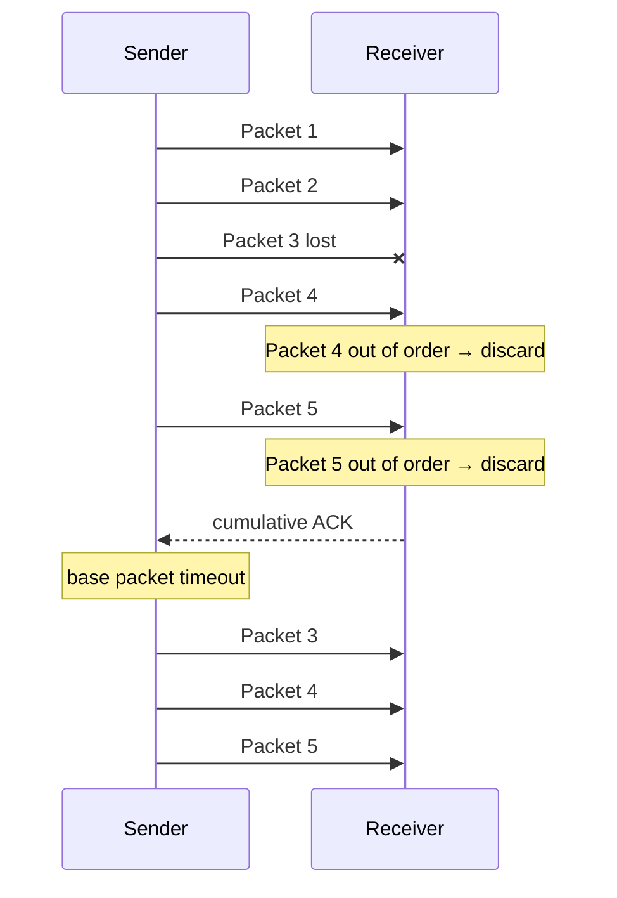

# OUC-TCP-Lab · GBN

<div align="center">

**Go-Back-N：基于发送窗口、累计 ACK 与统一超时机制的流水线可靠传输。**


[🏠 Main](https://github.com/Locusclaer/OUC-TCP-Lab/tree/main) · [← SR](https://github.com/Locusclaer/OUC-TCP-Lab/tree/SR) · [TCP →](https://github.com/Locusclaer/OUC-TCP-Lab/tree/TCP)

</div>

---

## 📖 分支定位

`GBN` 分支实现 **Go-Back-N（回退 N 帧）**。

它解决了 RDT 3.0 的核心性能问题：发送端不必在每发送一个 Packet 后都停下来等待，而是允许多个 Packet 连续进入网络。

本实现的核心机制包括：

- 大小为 16 的发送窗口；
- 环形缓冲区；
- `base / nextPointer / rearPointer` 三指针窗口管理；
- 累计 ACK；
- Receiver 只接受按序 Packet；
- 乱序 Packet 直接丢弃；
- 窗口左沿 Timer；
- Timeout 后从 `base` 开始重新发送所有未确认 Packet；
- Receiver 端 500 ms 延迟累计确认。

## 🪟 Sender Window

构造函数：

```java
window = new SenderWindow(this, 16, 3000, 3000);
```

核心变量：

```text
base
    最早已发送但尚未确认的 Packet

nextPointer
    下一个准备发送的 Packet

rearPointer
    当前已经装入窗口的尾部
```

窗口可以理解为：

```text
        已发送、未确认          可发送、未发送
             │                     │
             ▼                     ▼
[ ... ][ base ... next-1 ][ next ... rear-1 ]
```

### 环形缓冲区

绝对序号通过：

```java
seq % size
```

映射到大小为 16 的数组，从而重复利用固定空间。

## 📤 Pipelining

只要窗口未满，应用层数据就可以继续进入窗口：

```java
while (window.isFull()) {
    Thread.onSpinWait();
}
```

随后：

```java
window.PushPacket(tcpPack.clone());
window.SendPacket();
```

因此网络中可以同时存在多个尚未确认的报文。

## 📥 Receiver：只接收期望 Packet

GBN Receiver 的核心规则非常严格：

```text
seq == base
    → 接收并交付

seq < base
    → 已经接收过的重复 Packet

seq > base
    → 乱序 Packet，直接丢弃
```

与 SR 不同，GBN 不缓存乱序 Packet。

例如：

```text
Expected: 3

Receive 4 → discard
Receive 5 → discard
Receive 3 → accept
```

随后 4、5 必须由 Sender 再次发送。

## ✅ Cumulative ACK

发送端的 `AckPacket()` 使用：

```java
packet.seq <= ack.seq
```

来确认窗口中的多个 Packet。

因此：

```text
ACK 501
```

可以表示：

```text
所有 seq <= 501 的数据已经被累计确认
```

而不是只确认一个 Packet。

## ⏱️ Timeout：Go Back N

Timer 主要跟随窗口左沿 `base`。

当最老的未确认 Packet 超时后：

```java
nextPointer = base;
while (nextPointer < rearPointer) {
    SendPacket();
}
```

也就是重新发送当前窗口中从 `base` 开始的所有未确认 Packet：

```text
3 ×
4 ✓
5 ✓

Timeout
  ↓
Resend 3
Resend 4
Resend 5
```

这正是 **Go-Back-N** 名称的来源。

## 🕒 Receiver Delayed / Cumulative ACK

接收端在收到期望 Packet 后更新最后确认号，并重置一个约：

```text
500 ms
```

的确认 Timer。

若短时间内连续收到按序数据，可以利用后一个 ACK 对前面的 Packet 进行累计确认，从而减少 ACK 数量。

## 🔄 GBN 流程



## 📂 关键代码结构

```text
src/com/ouc/tcp/test/
├── AckFlag.java
├── CheckSum.java
├── ReceiverElem.java
├── ReceiverFlag.java
├── ReceiverWindow.java
├── SenderElem.java
├── SenderFlag.java
├── SenderWindow.java
├── TCP_Receiver.java
├── TCP_Sender.java
├── TestRun.java
├── WindowElement.java
└── WindowFlag.java
```

## 🆚 GBN 与 SR

| 对比项 | GBN | SR |
|---|---|---|
| Receiver 乱序缓存 | ❌ | ✅ |
| ACK | 累计确认 | 独立确认 |
| Timeout | 回退并重传多个 Packet | 只重传超时 Packet |
| Timer 管理 | 简单 | 较复杂 |
| 丢包后的冗余传输 | 较多 | 较少 |
| 实现复杂度 | 较低 | 较高 |

## 🚀 运行方式

项目使用 Maven 管理，`pom.xml` 将源码目录设置为 `src`，编译目标为 **Java 17**，入口类为：

```text
com.ouc.tcp.test.TestRun
```

`TestRun` 中通过课程框架的 `SystemStart.main(null)` 启动 TCP TestSys。

### 环境要求

- JDK 17
- Maven 3.x
- Linux
- 仓库中的 `lib/TCP_TestSys_Linux.jar`

### 编译

```bash
mvn clean package
```

也可以直接在 IntelliJ IDEA 中运行：

```text
src/com/ouc/tcp/test/TestRun.java
```

> `Config.ini` 中默认服务端口为 `18008`，发送端和接收端本地端口分别为 `19001`、`19002`。实际运行时仍需保证课程 TCP TestSys 服务端环境可用。

## 🔗 下一阶段

👉 [TCP：结合窗口缓存、累计确认和延迟 ACK 构造更接近 TCP 的可靠传输](https://github.com/Locusclaer/OUC-TCP-Lab/tree/TCP)

---

> 本仓库用于课程学习与个人实验归档，请勿直接复制作为课程作业提交。
