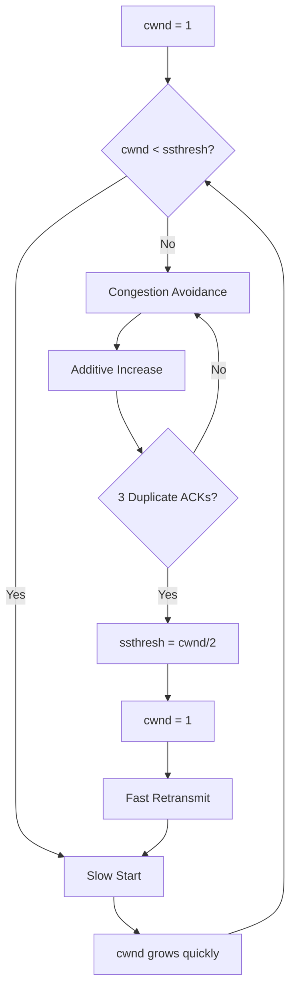

# OUC-TCP-Lab · Tahoe

<div align="center">

**TCP Tahoe：在可靠传输基础上实现拥塞窗口、慢启动、拥塞避免和快速重传。**


[🏠 Main](https://github.com/Locusclaer/OUC-TCP-Lab/tree/main) · [← TCP](https://github.com/Locusclaer/OUC-TCP-Lab/tree/TCP) · [Reno →](https://github.com/Locusclaer/OUC-TCP-Lab/tree/Reno)

</div>

---

## 📖 分支定位

`Tahoe` 分支在 `TCP` 可靠传输版本之上进一步加入 **Congestion Control（拥塞控制）**。

此前的滑动窗口主要解决：

```text
如何高效、可靠地发送多个 Packet？
```

而 Tahoe 开始解决：

```text
Sender 应该一次允许多少个 Packet 在网络中飞行？
```

因此固定大小发送窗口被动态的：

```text
cwnd = Congestion Window
```

取代。

本实现包含：

- `cwnd`
- `ssthresh`
- Slow Start
- Congestion Avoidance
- 3 Duplicate ACK Detection
- Fast Retransmit
- Tahoe 式拥塞响应

## 🚦 关键变量

`SenderWindow` 初始状态：

```java
private int cwnd = 1;
private double dcwnd = 1.0;
private int ssthresh = 16;
```

即：

```text
Initial cwnd = 1
Initial ssthresh = 16
```

Sender 是否可以继续发送由：

```java
window.size() >= cwnd
```

决定。

因此拥塞窗口直接控制当前未确认 Packet 的最大数量。

## 🚀 Slow Start

当：

```text
cwnd < ssthresh
```

时，每确认一个 Packet：

```java
cwnd++;
```

如果一个 RTT 内大约有 `cwnd` 个 Packet 得到 ACK，那么窗口会近似：

```text
1 → 2 → 4 → 8 → 16
```

呈指数增长。

Slow Start 的目的不是“发送得慢”，而是从较小窗口开始，快速探测网络能够承受的发送速率。

## 📈 Congestion Avoidance

当：

```text
cwnd >= ssthresh
```

时：

```java
dcwnd += 1.0 / cwnd;
cwnd = (int) dcwnd;
```

也就是说，每收到一个 ACK 只增加大约：

```text
1 / cwnd
```

经过大约一个 RTT 后，`cwnd` 总体增加约 1 MSS，实现**加性增大**。

窗口增长由：

```text
指数增长
```

切换为：

```text
线性增长
```

降低继续触发拥塞的风险。

## ⚡ Three Duplicate ACKs

发送窗口记录：

```text
latestseq
latestseqnum
maxlatestseq = 3
```

连续检测到 3 次相同 ACK 后，认为 ACK 之后的下一个报文很可能丢失。

`QuickResend()` 根据当前 ACK 推算并快速重传：

```text
expected seq = ACK seq + 100
```

无需等待完整超时周期。

## 📉 Tahoe 的拥塞响应

检测到 3 个重复 ACK 后：

```java
ssthresh = cwnd / 2;
cwnd = 1;
dcwnd = cwnd;
QuickResend(seq);
```

也就是说：

```text
ssthresh ← cwnd / 2
cwnd     ← 1
```

然后重新从 Slow Start 开始。

这正是 Tahoe 的典型特征：

> 无论通过重复 ACK 发现丢包还是将其视作拥塞信号，都采取较为保守的窗口回退策略。

## ⏱️ Timeout

窗口左沿仍然使用约：

```text
3000 ms
```

的 Timer。

若长时间没有得到确认，会触发窗口内未确认数据重传。

## 📥 Receiver

Receiver 延续 TCP 分支的设计：

- 窗口大小 16；
- 缓存窗口内乱序 Packet；
- 只按序交付应用层；
- 使用约 500 ms 的 Delayed ACK；
- 非正常顺序到达时及时反馈 ACK。

## 📊 cwnd 演化示例

```text
cwnd

16 |                     / / /
   |                  /
 8 |              /
   |          /
 4 |      /
   |   /
 2 | /
 1 |●                    ↓ packet loss
   +-------------------------------
      Slow Start       CA

Three Duplicate ACKs:
ssthresh = cwnd / 2
cwnd = 1
```

## 🔄 Tahoe 状态逻辑



## ⚠️ 关于本课程实现的说明

这一分支是**课程实验中的简化实现**，重点是展示拥塞窗口随 ACK / Duplicate ACK 的变化逻辑，并不等价于操作系统协议栈中的完整 TCP 状态机。

尤其从当前代码看，超时任务主要负责重新发送窗口中的未确认报文；`cwnd` / `ssthresh` 的显式调整主要写在重复 ACK 的处理路径中。因此阅读本分支时，应区分：

```text
课程实验中的机制演示
        ≠
RFC / Linux TCP 中完整的 Tahoe/Reno 实现
```

这种简化有利于单独观察 Slow Start、Congestion Avoidance 和快速重传策略的作用。

## 📂 关键代码

```text
src/com/ouc/tcp/test/
├── SenderWindow.java    # Tahoe 拥塞控制核心
├── ReceiverWindow.java
├── TCP_Sender.java
├── TCP_Receiver.java
├── SenderElem.java
├── ReceiverElem.java
├── CheckSum.java
└── TestRun.java
```

`SenderWindow.java` 是阅读本分支最重要的文件，`cwnd`、`ssthresh`、Slow Start、Congestion Avoidance 与 Duplicate ACK 处理都集中在这里。

## 🚀 运行方式

项目使用 Maven 管理，`pom.xml` 将源码目录设置为 `src`，编译目标为 **Java 17**，入口类为：

```text
com.ouc.tcp.test.TestRun
```

`TestRun` 中通过课程框架的 `SystemStart.main(null)` 启动 TCP TestSys。

### 环境要求

- JDK 17
- Maven 3.x
- Linux
- 仓库中的 `lib/TCP_TestSys_Linux.jar`

### 编译

```bash
mvn clean package
```

也可以直接在 IntelliJ IDEA 中运行：

```text
src/com/ouc/tcp/test/TestRun.java
```

> `Config.ini` 中默认服务端口为 `18008`，发送端和接收端本地端口分别为 `19001`、`19002`。实际运行时仍需保证课程 TCP TestSys 服务端环境可用。

## 🔗 下一阶段

👉 [Reno：在 Tahoe 基础上调整重复 ACK 后的窗口恢复策略](https://github.com/Locusclaer/OUC-TCP-Lab/tree/Reno)

---

> 本仓库用于课程学习与个人实验归档，请勿直接复制作为课程作业提交。
