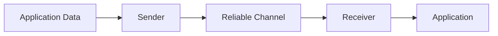
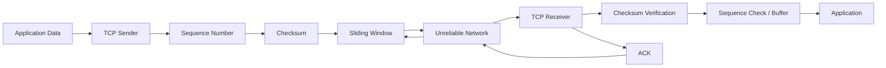

# OUC-TCP-Lab

<div align="center">

# 🛰️ OUC TCP Reliable Transmission Lab

**中国海洋大学《计算机网络》TCP 可靠传输协议实验**

从 **RDT 1.0** 出发，逐步实现差错检测、重传机制、流水线可靠传输以及 **TCP Tahoe / Reno 拥塞控制**。


</div>

---

## 📖 项目简介

本仓库记录 **中国海洋大学（Ocean University of China）《计算机网络》课程 TCP 大实验** 的实验过程与实验报告。

实验并非直接使用操作系统提供的 TCP Socket 完成文件传输，而是在课程提供的网络传输实验框架之上，从最基本的可靠数据传输协议开始，逐步考虑现实网络中可能出现的：

* Bit Error —— 数据位错误
* ACK / NAK 损坏
* Packet Loss —— 数据包丢失
* Packet Delay —— 网络延迟
* Packet Reordering —— 数据包乱序
* Network Congestion —— 网络拥塞

并通过 **Checksum、Sequence Number、ACK、Timer、Retransmission、Sliding Window、Congestion Window** 等机制不断完善协议。

整个实验体现了一条完整的协议演化路径：

```text
RDT 1.0
   ↓
RDT 2.0
   ↓
RDT 2.1
   ↓
RDT 2.2
   ↓
RDT 3.0
   ↓
Go-Back-N / Selective Repeat
   ↓
TCP Reliable Transmission
   ↓
TCP Tahoe
   ↓
TCP Reno
```

实验的核心目标是理解：

> **TCP 为什么需要这些机制，以及这些机制是如何从一个最简单的可靠传输协议一步一步演化出来的。**

---

# 📂 Repository Structure

当前仓库主要用于保存实验报告：

```text
OUC-TCP-Lab/
│
├── README.md
│
└── 翟一航-23020011046-TCP实验报告.pdf
```

其中：

| 文件                            | 说明                                 |
| ----------------------------- | ---------------------------------- |
| `README.md`                   | 项目介绍与 TCP 实验原理总结                   |
| `翟一航-23020011046-TCP实验报告.pdf` | 完整 TCP 大实验报告，包括协议实现思路、实验过程、运行结果与分析 |

📄 **完整实验报告：**

[👉 点击查看 TCP 实验报告](./翟一航-23020011046-TCP实验报告.pdf)

---

# 🎯 实验目标

本实验主要围绕 **Transport Layer（传输层）中的可靠数据传输** 展开，通过迭代方式理解 TCP 可靠传输与拥塞控制机制。

主要实验目标包括：

1. 理解可靠数据传输协议 RDT 的基本设计思想；
2. 掌握 Checksum 差错检测机制；
3. 理解 ACK / NAK 与自动重传机制 ARQ；
4. 理解 Sequence Number 在处理重复数据包中的作用；
5. 掌握 Timeout 与 Retransmission；
6. 理解 Stop-and-Wait 协议存在的性能问题；
7. 掌握 Sliding Window 滑动窗口机制；
8. 理解 Go-Back-N 与 Selective Repeat 的区别；
9. 理解 TCP 可靠传输的基本思想；
10. 掌握 TCP Congestion Control；
11. 理解 Slow Start 与 Congestion Avoidance；
12. 理解 Fast Retransmit 与 Fast Recovery；
13. 对比 TCP Tahoe 与 TCP Reno 的拥塞控制策略。

---

# 🔄 协议演进

## 1. RDT 1.0 —— Reliable Channel

### 信道假设

RDT 1.0 假设底层信道完全可靠：

```text
No Bit Error
No Packet Loss
No Delay
```

因此发送方只需要发送数据，接收方收到数据后交付给上层即可。



此时无需：

* Checksum
* ACK
* Sequence Number
* Timer
* Retransmission

RDT 1.0 的意义主要在于建立整个可靠传输实验的最基本框架。

---

## 2. RDT 2.0 —— Bit Error

RDT 2.0 开始假设：

> 数据在传输过程中可能发生 **Bit Error**。

因此协议需要解决两个问题：

### Checksum

发送方计算 TCP Segment 的校验和：

```text
Data
 ↓
Checksum Calculation
 ↓
Packet Transmission
```

接收方重新计算 Checksum，并与报文中的 Checksum 比较。

如果一致：

```text
Receiver → ACK → Sender
```

如果检测到错误：

```text
Receiver → NAK → Sender
                 ↓
             Retransmit
```

由此形成最基本的 **ARQ（Automatic Repeat reQuest）自动重传机制**。

---

# 3. RDT 2.1 —— ACK / NAK 也可能损坏

RDT 2.0 仍然存在一个问题：

```text
Sender → DATA → Receiver
Sender ← ACK  ← Receiver
```

如果 ACK 本身发生错误，Sender 就无法判断：

```text
数据到底有没有成功收到？
```

因此 RDT 2.1 引入：

## Sequence Number

例如：

```text
SEQ = 0
SEQ = 1
SEQ = 0
SEQ = 1
...
```

即经典的 **Alternating Bit Protocol**。

如果 Sender 无法正确判断 ACK，则重新发送当前 Packet。

Receiver 根据 Sequence Number 判断：

```text
New Packet
    ↓
Deliver to Application

Duplicate Packet
    ↓
Discard
    ↓
Resend ACK
```

这样即使发生重复传输，也不会导致上层收到重复数据。

---

# 4. RDT 2.2 —— NAK-Free Protocol

RDT 2.2 进一步取消 NAK。

协议只使用：

```text
ACK
```

如果接收方发现数据包损坏，则返回：

```text
ACK of the last correctly received packet
```

发送方收到重复 ACK 后即可判断当前数据可能出现问题。

因此：

```text
ACK + Sequence Number
```

即可代替：

```text
ACK + NAK
```

这一思想与实际 TCP 的设计更加接近。

---

# 5. RDT 3.0 —— Packet Loss

RDT 3.0 开始进一步考虑：

> 数据包不仅可能出现 Bit Error，还可能直接丢失。

例如：

```text
Sender
   │
   │ DATA
   ▼
  ×     ← Packet Lost
   │
Receiver
```

如果 Packet 或 ACK 直接丢失，仅依靠 ACK 已无法完成可靠传输。

因此需要引入：

# ⏱️ Timer

发送 Packet 后启动计时器：

```text
Send Packet
     ↓
Start Timer
     ↓
Wait for ACK
     ↓
 ┌───────────────┐
 │               │
ACK            Timeout
 │               │
 ▼               ▼
Stop Timer    Retransmit
```

通过：

* Checksum
* Sequence Number
* ACK
* Timeout
* Retransmission

RDT 3.0 已经可以在存在：

```text
Bit Error + Packet Loss
```

的信道中实现可靠传输。

---

# 🚚 Pipeline Protocol

Stop-and-Wait 协议虽然能够保证可靠性，但网络利用率非常低。

假设：

```text
RTT >> Packet Transmission Time
```

Sender 在大部分时间都只能等待 ACK。

因此需要引入：

# Sliding Window

允许 Sender 在尚未收到前一个 Packet ACK 时继续发送多个 Packet：

```text
Packet 1 ───────────────►
Packet 2 ───────────────►
Packet 3 ───────────────►
Packet 4 ───────────────►
         ◄──────── ACK 1
         ◄──────── ACK 2
```

由此形成流水线可靠传输。

主要包括两种协议：

```text
Go-Back-N
Selective Repeat
```

---

# 6. Go-Back-N（GBN）

GBN 使用固定大小的发送窗口。

假设：

```text
Window Size = N
```

发送方最多可以连续发送 N 个尚未确认的数据包。

例如：

```text
Sequence Number

1   2   3   4   5   6   7   8   9
└────── Window ──────┘
```

收到 ACK 后窗口向右移动：

```text
Before

[1 2 3 4] 5 6 7 8

ACK 1
ACK 2

After

1 2 [3 4 5 6] 7 8
```

---

## Cumulative ACK

GBN 使用 **累计确认**。

例如：

```text
ACK 5
```

表示：

```text
Packet 1 ~ Packet 5
```

均已正确接收。

---

## Retransmission

如果 Packet 3 丢失：

```text
1 ✓
2 ✓
3 ×
4 → discarded
5 → discarded
```

Sender 超时后需要重新发送：

```text
3
4
5
...
```

即：

> **Go Back N packets and retransmit.**

因此实现较为简单，但网络发生丢包时可能产生大量重复传输。

---

# 7. Selective Repeat（SR）

Selective Repeat 对 GBN 进行了进一步优化。

最大的区别是：

> **只重传真正丢失的数据包。**

例如：

```text
Packet 1 ✓
Packet 2 ✓
Packet 3 ×
Packet 4 ✓
Packet 5 ✓
```

Receiver 可以缓存：

```text
Packet 4
Packet 5
```

Sender 只需要重新发送：

```text
Packet 3
```

收到 Packet 3 后：

```text
3 → 4 → 5
```

再按照正确顺序交付上层。

---

## GBN vs SR

| 特性                  | Go-Back-N       | Selective Repeat |
| ------------------- | --------------- | ---------------- |
| Sender Window       | ✅               | ✅                |
| Receiver Window     | 简单              | ✅                |
| Out-of-order Buffer | ❌               | ✅                |
| ACK                 | Cumulative ACK  | Individual ACK   |
| Timer               | 通常针对窗口最早 Packet | 每个 Packet 独立维护   |
| Retransmission      | 重传连续多个 Packet   | 只重传丢失 Packet     |
| Implementation      | 简单              | 较复杂              |
| Network Efficiency  | 较低              | 较高               |

SR 使用更多状态和缓存空间换取更高的网络传输效率。

---

# 🌐 TCP Reliable Transmission

在完成 RDT、GBN 和 SR 后，进一步构建更加接近 TCP 的可靠传输机制。

TCP 的可靠性建立在多个机制之上：

```text
Checksum
      +
Sequence Number
      +
ACK
      +
Retransmission
      +
Sliding Window
      +
Timeout
```

其基本数据传输过程可以表示为：



至此已经解决了：

```text
可靠传输问题
```

但还有另一个重要问题：

# 网络拥塞

---

# 🚦 TCP Congestion Control

如果 Sender 不加限制地发送数据：

```text
Sender 1 ──┐
Sender 2 ──┼──► Router ──► Bottleneck
Sender 3 ──┤
Sender 4 ──┘
```

路由器缓存可能迅速耗尽，导致：

```text
Packet Loss
      ↓
Retransmission
      ↓
More Traffic
      ↓
More Packet Loss
```

严重时甚至可能导致：

> **Congestion Collapse**

因此 TCP 需要根据网络状况动态调整发送速率。

核心变量包括：

```text
cwnd      = Congestion Window
ssthresh  = Slow Start Threshold
```

---

# 8. TCP Tahoe

TCP Tahoe 主要包含：

```text
Slow Start
+
Congestion Avoidance
+
Fast Retransmit
```

---

## Slow Start

连接开始时：

```text
cwnd = 1
```

每经过一个 RTT，cwnd 近似指数增长：

```text
1
2
4
8
16
...
```

即：

```text
cwnd ← 2 × cwnd
```

直到：

```text
cwnd >= ssthresh
```

进入 Congestion Avoidance。

---

## Congestion Avoidance

进入拥塞避免阶段后，窗口增长变慢：

```text
16
17
18
19
20
...
```

即近似：

```text
每个 RTT 增加 1 MSS
```

这种机制称为：

> **AIMD — Additive Increase / Multiplicative Decrease**

---

## Detect Congestion

当出现：

```text
Timeout
```

或检测到网络拥塞后：

```text
ssthresh = cwnd / 2
cwnd = 1
```

随后重新进入 Slow Start。

因此 Tahoe 的特点是：

> 一旦认为网络发生拥塞，就将拥塞窗口大幅降低。

---

# 9. TCP Reno

TCP Reno 在 Tahoe 的基础上增加：

# Fast Recovery

如果 Sender 连续收到多个 Duplicate ACK：

```text
ACK 10
ACK 10
ACK 10
```

说明：

```text
Packet 11 很可能丢失
```

但后续 Packet 仍然能够到达 Receiver，因此网络并非完全阻塞。

此时没有必要：

```text
cwnd → 1
```

Reno 会执行：

```text
Fast Retransmit
        ↓
Fast Recovery
```

快速重传缺失 Packet，并降低但不完全清空发送窗口。

---

## Tahoe vs Reno

| Mechanism            | TCP Tahoe                      | TCP Reno                        |
| -------------------- | ------------------------------ | ------------------------------- |
| Slow Start           | ✅                              | ✅                               |
| Congestion Avoidance | ✅                              | ✅                               |
| Fast Retransmit      | ✅                              | ✅                               |
| Fast Recovery        | ❌                              | ✅                               |
| Timeout 后 cwnd       | 重新降到较小值                        | 重新进入 Slow Start                 |
| Duplicate ACK        | Fast Retransmit 后进入 Slow Start | Fast Retransmit + Fast Recovery |
| 单包丢失恢复效率             | 较低                             | 较高                              |

Reno 的核心改进在于：

> **能够区分“网络严重拥塞”和“少量数据包丢失”，从而避免不必要地将发送速率降到最低。**

---

# 🧠 核心知识点总结

完成整个实验后，TCP 可靠传输的核心机制可以归纳为：

| Mechanism            | Problem                              |
| -------------------- | ------------------------------------ |
| Checksum             | Bit Error                            |
| ACK                  | 确认数据是否成功接收                           |
| Sequence Number      | Duplicate / Disorder                 |
| Timer                | Packet Loss                          |
| Retransmission       | 恢复丢失数据                               |
| Sliding Window       | 提高信道利用率                              |
| Cumulative ACK       | 简化确认机制                               |
| Receiver Buffer      | 保存乱序数据                               |
| RTT / Timeout        | 判断是否需要重传                             |
| cwnd                 | 控制发送速率                               |
| ssthresh             | 区分 Slow Start / Congestion Avoidance |
| Slow Start           | 探测网络可用容量                             |
| Congestion Avoidance | 平稳增加发送速率                             |
| Fast Retransmit      | 快速发现 Packet Loss                     |
| Fast Recovery        | 避免不必要地重新 Slow Start                  |

---

# 🧩 实验整体逻辑

整个实验实际上回答了下面几个问题。

### Q1：如果网络完全可靠怎么办？

```text
RDT 1.0
```

直接发送。

---

### Q2：如果数据可能发生错误怎么办？

```text
Checksum
+
ACK / NAK
```

得到：

```text
RDT 2.0
```

---

### Q3：如果 ACK 也可能错误怎么办？

```text
Sequence Number
```

得到：

```text
RDT 2.1
```

---

### Q4：能不能去掉 NAK？

```text
Duplicate ACK
```

得到：

```text
RDT 2.2
```

---

### Q5：如果 Packet 直接丢了怎么办？

```text
Timer
+
Retransmission
```

得到：

```text
RDT 3.0
```

---

### Q6：Stop-and-Wait 太慢怎么办？

```text
Sliding Window
```

得到：

```text
GBN / SR
```

---

### Q7：可靠了以后，如果发得太快怎么办？

```text
Congestion Control
```

得到：

```text
TCP Tahoe
TCP Reno
```

---

# 💡 实验收获

本实验最大的价值并不是简单实现一个 Sender / Receiver，而是通过 **Incremental Development（迭代开发）** 的方式理解可靠传输协议的设计逻辑。

从：

```text
Reliable Channel
```

逐渐放宽假设：

```text
Bit Error
    ↓
ACK Error
    ↓
Packet Loss
    ↓
Packet Delay
    ↓
Low Utilization
    ↓
Network Congestion
```

每增加一个现实网络问题，就增加一种新的协议机制：

```text
Checksum
ACK
Sequence Number
Timer
Retransmission
Sliding Window
Congestion Control
```

最终可以更加直观地理解：

> **TCP 并不是由一组彼此独立的机制简单拼接而成，而是在复杂、不可靠的网络环境中，为了解决可靠性、效率与公平性问题逐步形成的一套完整协议体系。**

---

# 🛠️ Development Environment

该实验基于课程提供的 TCP 实验框架完成，典型开发环境为：

```text
Language       : Java
JDK            : Java 8
IDE            : IntelliJ IDEA
Protocol       : RDT / TCP
Course         : Computer Networks
University     : Ocean University of China
```

实验框架负责模拟不可靠网络环境，通过改变网络条件测试协议在：

```text
Error
Loss
Delay
```

等情况下的可靠传输能力。

---

# 📊 实验验证

各阶段协议主要通过以下几个方面进行验证：

### 1. Correctness

检查发送数据与最终接收数据是否一致：

```text
Send Data
    ↓
Unreliable Network
    ↓
Receive Data
```

最终应满足：

```text
Send Data == Receive Data
```

---

### 2. Reliability

人为引入：

```text
Bit Error
Packet Loss
Packet Delay
```

验证协议是否仍能够正确完成数据传输。

---

### 3. Retransmission

通过运行日志观察：

```text
Send
ACK
Timeout
Retransmit
```

判断重传机制是否正常工作。

---

### 4. Sliding Window

观察：

```text
base
nextSeqNum
window size
ACK
```

变化，验证发送窗口与接收窗口是否正确滑动。

---

### 5. Congestion Control

通过记录：

```text
cwnd
ssthresh
```

观察：

```text
Slow Start
       ↓
Congestion Avoidance
       ↓
Packet Loss
       ↓
Fast Retransmit / Fast Recovery
```

等阶段的窗口变化。

完整实验过程、运行结果以及问题分析见：

📄 **[TCP 实验报告](./翟一航-23020011046-TCP实验报告.pdf)**

---

# 📚 Related Concepts

本实验涉及的计算机网络核心知识包括：

* Reliable Data Transfer
* Stop-and-Wait Protocol
* Automatic Repeat reQuest
* Checksum
* Sequence Number
* Acknowledgement
* Timeout & Retransmission
* Pipelined Protocol
* Sliding Window
* Go-Back-N
* Selective Repeat
* Round Trip Time
* Flow Control
* Congestion Control
* Congestion Window
* Slow Start
* Congestion Avoidance
* AIMD
* Fast Retransmit
* Fast Recovery
* TCP Tahoe
* TCP Reno

---

# ⚠️ Academic Integrity

本仓库仅用于：

* 个人课程实验归档
* 计算机网络知识总结
* TCP / RDT 协议学习与交流

如果你正在修读相同或类似课程，请独立完成自己的实验。

**请勿直接复制实验实现或实验报告作为课程作业提交。**

理解协议设计过程本身，远比得到一份可以运行的代码更加重要。

---

# 👨‍💻 Author

**Yihang Zhai / 翟一航**

Ocean University of China

GitHub: [@Locusclaer](https://github.com/Locusclaer)

---

## ⭐ Acknowledgement

感谢中国海洋大学《计算机网络》课程提供的 TCP 实验框架与实验环境。

如果这个仓库对你理解 **RDT、Sliding Window 或 TCP Congestion Control** 有帮助，欢迎 Star ⭐。

---

<div align="center">

**OUC · Computer Networks · TCP Reliable Transmission Lab**

`RDT → GBN / SR → TCP → Tahoe → Reno`

</div>
