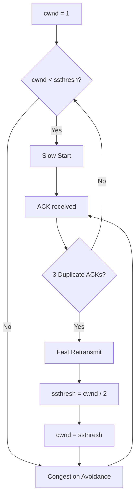

# OUC-TCP-Lab · Reno

<div align="center">

**TCP Reno：在 Tahoe 基础上改进重复 ACK 后的拥塞恢复，避免将 cwnd 直接降回 1。**


[🏠 Main](https://github.com/Locusclaer/OUC-TCP-Lab/tree/main) · [← Tahoe](https://github.com/Locusclaer/OUC-TCP-Lab/tree/Tahoe)

</div>

---

## 📖 分支定位

`Reno` 是本仓库协议演进的最后一个阶段。

它保留 Tahoe 已有的：

- Slow Start；
- Congestion Avoidance；
- Cumulative ACK；
- Delayed ACK；
- Sliding Window；
- Timeout Retransmission；
- Three Duplicate ACK Detection；
- Fast Retransmit；

同时修改了重复 ACK 触发丢包后的拥塞窗口恢复策略。

核心思想是：

> 收到多个重复 ACK 说明后续报文仍能到达 Receiver，网络并没有完全停止工作，因此没有必要像 Tahoe 一样把 `cwnd` 直接降到 1。

## 🆚 与 Tahoe 的关键差异

Tahoe 在检测到 3 个重复 ACK 后：

```text
ssthresh = cwnd / 2
cwnd = 1
```

Reno 分支修改为：

```text
ssthresh = cwnd / 2
cwnd = ssthresh
```

代码：

```java
if (latestseqnum == maxlatestseq) {
    ssthresh = cwnd / 2;
    cwnd = ssthresh;
    dcwnd = cwnd;
    QuickResend(seq);
}
```

因此不会重新从 `cwnd = 1` 开始探测。

## 🚀 Slow Start

初始状态：

```java
cwnd = 1;
ssthresh = 16;
```

当：

```text
cwnd < ssthresh
```

时，每确认一个 Packet：

```java
cwnd++;
```

因此在一个 RTT 尺度上近似指数增长：

```text
1 → 2 → 4 → 8 → 16
```

## 📈 Congestion Avoidance

达到阈值后：

```java
dcwnd += 1.0 / cwnd;
cwnd = (int) dcwnd;
```

窗口在一个 RTT 内总体约增加 1，实现 Additive Increase。

```text
16 → 17 → 18 → 19 → ...
```

## ⚡ Fast Retransmit

Sender 持续记录 ACK：

```text
latestseq
latestseqnum
```

当同一 ACK 出现 3 次时：

```text
Duplicate ACK × 3
        ↓
推断 ACK 后面的 Packet 丢失
        ↓
QuickResend()
```

本实现按实验数据块长度推算下一 Sequence Number：

```java
expectedseq = seq + 100;
```

找到对应 Packet 后立即重发。

## ♻️ Reno 式恢复

假设丢包前：

```text
cwnd = 12
```

则检测到重复 ACK 后：

```text
ssthresh = 6
cwnd = 6
```

而 Tahoe 会：

```text
ssthresh = 6
cwnd = 1
```

因此 Reno 能保留更多已经探测出的网络容量，在单个报文丢失的环境下恢复速度通常更快。

## 📊 Tahoe vs Reno

| 机制 | Tahoe | Reno branch |
|---|---|---|
| Slow Start | ✅ | ✅ |
| Congestion Avoidance | ✅ | ✅ |
| 3 Duplicate ACK | ✅ | ✅ |
| Fast Retransmit | ✅ | ✅ |
| 重复 ACK 后 `ssthresh` | `cwnd / 2` | `cwnd / 2` |
| 重复 ACK 后 `cwnd` | `1` | `ssthresh` |
| 恢复速度 | 更保守 | 更快 |

## ⏱️ Timer 与重传

发送窗口使用约：

```text
delay = 3000 ms
period = 3000 ms
```

的重传 Timer。

如果 ACK 长时间没有推进窗口，Timer 会重新发送当前窗口中尚未确认的 Packet。

这一机制负责处理不能通过 Duplicate ACK 快速发现的丢失情况。

## 📥 Receiver

Receiver 继续沿用前一阶段的可靠传输机制：

- Receiver Window = 16；
- 窗口内乱序 Packet 可缓存；
- `PacketDeliver()` 只按序交付；
- Checksum 错误报文丢弃；
- 正常顺序数据采用约 500 ms Delayed ACK；
- 异常顺序到达时及时反馈当前 ACK。

## 🔄 Reno 工作逻辑



## ⚠️ 关于本课程实现的说明

这一分支是**课程实验中的简化实现**，重点是展示拥塞窗口随 ACK / Duplicate ACK 的变化逻辑，并不等价于操作系统协议栈中的完整 TCP 状态机。

尤其从当前代码看，超时任务主要负责重新发送窗口中的未确认报文；`cwnd` / `ssthresh` 的显式调整主要写在重复 ACK 的处理路径中。因此阅读本分支时，应区分：

```text
课程实验中的机制演示
        ≠
RFC / Linux TCP 中完整的 Tahoe/Reno 实现
```

这种简化有利于单独观察 Slow Start、Congestion Avoidance 和快速重传策略的作用。

## 📂 关键代码结构

```text
src/com/ouc/tcp/test/
├── AckFlag.java
├── CheckSum.java
├── ReceiverElem.java
├── ReceiverFlag.java
├── ReceiverWindow.java
├── SenderElem.java
├── SenderFlag.java
├── SenderWindow.java
├── TCP_Receiver.java
├── TCP_Sender.java
├── TestRun.java
└── WindowElement.java
```

其中最值得关注的是：

```text
SenderWindow.java
```

它集中体现了本分支的：

```text
cwnd
ssthresh
Slow Start
Congestion Avoidance
Duplicate ACK Counting
QuickResend
```

## 🧠 完整实验演进

```text
RDT_1.0
   ↓
RDT_2.0
   ↓
RDT_2.2
   ↓
RDT_3.0
   ↓
SR / GBN
   ↓
TCP Reliable Transmission
   ↓
TCP Tahoe
   ↓
TCP Reno
```

从最简单的“理想可靠信道”开始，逐步加入：

```text
Checksum
ACK
Retransmission
Timeout
Sliding Window
Receiver Buffer
Cumulative ACK
Delayed ACK
cwnd
ssthresh
Fast Retransmit
Congestion Control
```

最终完成从可靠数据传输到 TCP 拥塞控制的一条完整实验链路。

## 🚀 运行方式

项目使用 Maven 管理，`pom.xml` 将源码目录设置为 `src`，编译目标为 **Java 17**，入口类为：

```text
com.ouc.tcp.test.TestRun
```

`TestRun` 中通过课程框架的 `SystemStart.main(null)` 启动 TCP TestSys。

### 环境要求

- JDK 17
- Maven 3.x
- Linux
- 仓库中的 `lib/TCP_TestSys_Linux.jar`

### 编译

```bash
mvn clean package
```

也可以直接在 IntelliJ IDEA 中运行：

```text
src/com/ouc/tcp/test/TestRun.java
```

> `Config.ini` 中默认服务端口为 `18008`，发送端和接收端本地端口分别为 `19001`、`19002`。实际运行时仍需保证课程 TCP TestSys 服务端环境可用。

## 🔗 返回项目总览

👉 [Main Branch：查看 OUC-TCP-Lab 完整实验说明](https://github.com/Locusclaer/OUC-TCP-Lab/tree/main)

---

> 本仓库用于中国海洋大学《计算机网络》课程实验学习与个人归档，请独立完成课程作业。
