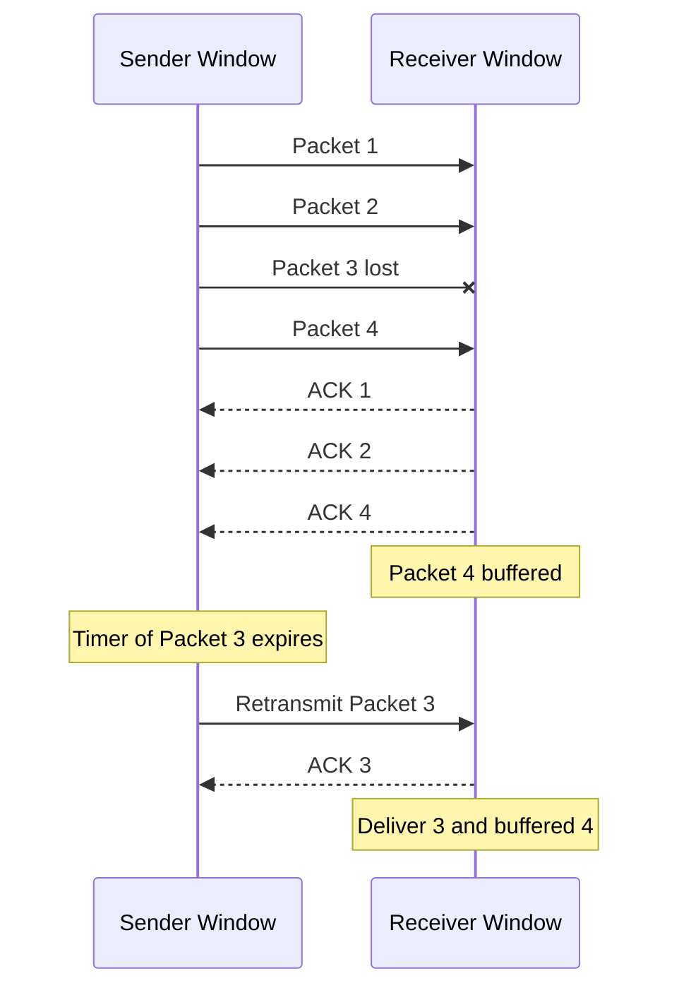

# OUC-TCP-Lab · SR

<div align="center">

**Selective Repeat：使用滑动窗口、乱序缓存和逐包定时器实现高效可靠传输。**


[🏠 Main](https://github.com/Locusclaer/OUC-TCP-Lab/tree/main) · [← RDT_3.0](https://github.com/Locusclaer/OUC-TCP-Lab/tree/RDT_3.0) · [GBN →](https://github.com/Locusclaer/OUC-TCP-Lab/tree/GBN)

</div>

---

## 📖 分支定位

`SR` 分支将 RDT 3.0 的 Stop-and-Wait 扩展为 **Selective Repeat（选择重传）**。

与一次只能发送一个报文的 RDT 3.0 不同，SR 允许多个未确认报文同时在网络中传输，并且：

> **哪个报文丢了，就只重传哪个报文。**

为此，本分支实现了：

- Sender Sliding Window；
- Receiver Sliding Window；
- 环形缓冲区；
- 乱序数据缓存；
- Individual ACK；
- 每个 Packet 独立的重传计时器；
- 连续数据按序交付。

## 🪟 发送窗口

`TCP_Sender` 中：

```java
private final SenderWindow window = new SenderWindow(16);
```

因此发送窗口大小为：

```text
16 packets
```

当窗口已满时：

```java
while (window.isFull()) {
    Thread.onSpinWait();
}
```

应用层继续等待，直到 ACK 到达并使窗口向前滑动。

### 为什么要 clone Packet？

数据进入窗口时：

```java
window.PushPacket(tcpPack.clone());
```

因为课程框架中的 Header / Segment 对象会被后续发送继续修改。如果窗口保存同一对象引用，之前的数据可能被覆盖，从而破坏超时重传。

## ⏱️ 每个报文独立计时

SR 与 GBN 的一个关键差异在 `SenderElem`：

```text
SenderElem
├── TCP_PACKET
├── ACK 状态
└── UDT_Timer
```

每个未确认 Packet 都拥有自己的 Timer。

发送时：

```java
window[index].scheduleTask(
    new UDT_RetransTask(client, packet),
    1000,
    1000
);
```

收到该 Packet 对应 ACK 后，只取消该 Packet 的计时器。

因此：

```text
Packet 3 lost
Packet 4 correct
Packet 5 correct
```

最终只需要重传：

```text
Packet 3
```

而不是把 3、4、5 全部重新发送。

## 📥 Receiver Window

接收窗口同样为 16。

收到报文后分为四种情况：

```text
seq < base
    → DUPLICATE

seq == base
    → IS_BASE

base < seq < base + window_size
    → WITHIN

seq >= base + window_size
    → OUTSIDE
```

### 乱序缓存

只要 Packet 位于当前接收窗口内：

```java
window[getIndex(seq)].setElem(
    packet,
    ReceiverFlag.BUFFERED.ordinal()
);
```

就可以被缓存。

例如：

```text
Expected: 3

Receive 5 → Buffer
Receive 4 → Buffer
Receive 3 → Buffer
```

此时 `PacketDeliver()` 会连续交付：

```text
3 → 4 → 5
```

然后 Receiver Window 一次向前滑动多个位置。

## ✅ Individual ACK

对于窗口内的有效报文，Receiver 回复：

```text
ACK = received packet.seq
```

Sender 调用：

```java
window.AckPacket(currentAck);
```

只标记**与该 ACK 完全对应的报文**：

```java
packet.seq == ack.seq
```

因此 SR 采用的是逐包确认逻辑，而不是 GBN 的累计确认。

## 🔄 SR 工作流程



## 📂 关键代码结构

```text
src/com/ouc/tcp/test/
├── AckFlag.java
├── CheckSum.java
├── ReceiverElem.java
├── ReceiverFlag.java
├── ReceiverWindow.java
├── SenderElem.java
├── SenderFlag.java
├── SenderWindow.java
├── TCP_Receiver.java
├── TCP_Sender.java
├── TestRun.java
└── WindowElement.java
```

| 文件 | 作用 |
|---|---|
| `SenderWindow.java` | 管理发送窗口、逐包 ACK 与窗口滑动 |
| `SenderElem.java` | 保存 Packet、ACK 状态和独立 Timer |
| `ReceiverWindow.java` | 缓存窗口内乱序报文并按序交付 |
| `ReceiverElem.java` | 保存接收缓存单元状态 |
| `TCP_Sender.java` | 封装数据并放入发送窗口 |
| `TCP_Receiver.java` | 校验、ACK、缓存、交付 |

## 🆚 SR 与 GBN

| 对比项 | SR | GBN |
|---|---|---|
| ACK | 独立确认 | 累计确认 |
| 接收乱序包 | 缓存 | 丢弃 |
| Timer | 每个 Packet 独立 | 主要针对窗口左沿 |
| 超时 | 只重传对应 Packet | 重传多个未确认 Packet |
| 网络利用率 | 较高 | 丢包时较低 |
| 实现复杂度 | 较高 | 较低 |

## 🚀 运行方式

项目使用 Maven 管理，`pom.xml` 将源码目录设置为 `src`，编译目标为 **Java 17**，入口类为：

```text
com.ouc.tcp.test.TestRun
```

`TestRun` 中通过课程框架的 `SystemStart.main(null)` 启动 TCP TestSys。

### 环境要求

- JDK 17
- Maven 3.x
- Linux
- 仓库中的 `lib/TCP_TestSys_Linux.jar`

### 编译

```bash
mvn clean package
```

也可以直接在 IntelliJ IDEA 中运行：

```text
src/com/ouc/tcp/test/TestRun.java
```

> `Config.ini` 中默认服务端口为 `18008`，发送端和接收端本地端口分别为 `19001`、`19002`。实际运行时仍需保证课程 TCP TestSys 服务端环境可用。

## 🔗 相关分支

- [GBN：另一种流水线可靠传输实现](https://github.com/Locusclaer/OUC-TCP-Lab/tree/GBN)
- [TCP：在滑动窗口基础上进一步接近 TCP 的累计确认机制](https://github.com/Locusclaer/OUC-TCP-Lab/tree/TCP)

---

> 本仓库用于课程学习与个人实验归档，请勿直接复制作为课程作业提交。
