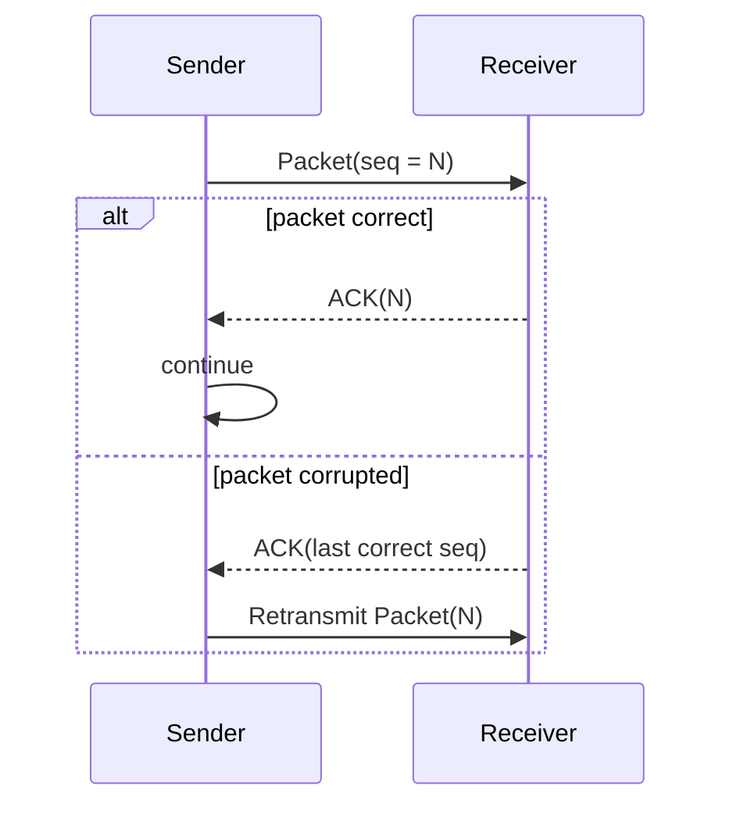

# OUC-TCP-Lab · RDT_2.2

<div align="center">

**NAK-Free Reliable Data Transfer：利用 ACK 与序号处理损坏报文和重复数据。**


[🏠 Main](https://github.com/Locusclaer/OUC-TCP-Lab/tree/main) · [← RDT_2.0](https://github.com/Locusclaer/OUC-TCP-Lab/tree/RDT_2.0) · [RDT_3.0 →](https://github.com/Locusclaer/OUC-TCP-Lab/tree/RDT_3.0)

</div>

---

## 📖 分支定位

`RDT_2.2` 在 `RDT_2.0` 的基础上继续简化反馈机制：

> **不再依赖显式 NACK，而是使用 ACK 本身表达接收状态。**

当 Receiver 检测到报文损坏时，不再返回 `ACK = -1`，而是返回**最后一个按序正确接收的数据对应的 ACK**。Sender 如果收到的 ACK 不是当前正在等待的确认号，就会重新发送当前报文。

这种“只使用 ACK”的思路已经更接近真实 TCP。

## ✨ 相比 RDT_2.0 的变化

```text
RDT_2.0
损坏 → NACK(-1)
        ↓
RDT_2.2
损坏 → ACK(last correctly received packet)
```

核心机制由：

```text
ACK + NACK
```

变为：

```text
ACK + Sequence Number + Duplicate/Old ACK
```

## 🔧 核心实现

### 1. Receiver 维护期望序号

接收端使用：

```java
int sequence = 0;
```

表示当前期望的数据块索引，并根据 TCP Sequence Number 计算：

```java
int dataIndex =
    (recvPack.getTcpH().getTh_seq() - 1)
    / recvPack.getTcpS().getData().length;
```

只有：

```text
dataIndex == sequence
```

时，当前数据才会进入 `dataQueue`，随后 `sequence++`。

因此重复报文不会被重复交付给应用层。

### 2. 正确报文

若 Checksum 正确：

```text
ACK = received seq
```

发送 ACK，同时仅在报文恰好是当前期望数据时执行交付。

### 3. 损坏报文

若 Checksum 错误，Receiver 返回：

```java
tcpH.setTh_ack(
    (sequence - 1) * recvPack.getTcpS().getData().length + 1
);
```

即用“最后一个已经正确处理的数据”的确认信息替代显式 NACK。

### 4. Sender

发送端仍然采用 Stop-and-Wait：

```text
ACK == current packet seq
        ↓
当前报文完成

ACK != current packet seq
        ↓
重传当前报文
```

## 🔄 协议流程



## ✅ 本阶段解决的问题

- 数据报内容损坏；
- 重复数据到达；
- 不再依赖 NACK；
- 使用序号保证应用层按序、且只交付一次。

## ⚠️ 尚未解决的问题

本阶段仍然没有超时机制。

如果：

```text
DATA packet lost
```

或者：

```text
ACK packet lost
```

Sender 无法通过“收到错误 ACK”触发重传，因为它可能什么都收不到。

这正是 RDT 3.0 引入 **Timer / Timeout Retransmission** 的原因。

## 📂 关键文件

```text
src/com/ouc/tcp/test/
├── CheckSum.java
├── TCP_Sender.java
├── TCP_Receiver.java
└── TestRun.java
```

## 🧠 核心知识点

`RDT_2.2` 的关键思想是：

> **确认报文不仅可以表示“成功”，还可以携带接收端当前已经确认到哪里的状态。**

这为后面的累计确认、重复 ACK、快速重传等 TCP 机制奠定了基础。

## 🚀 运行方式

项目使用 Maven 管理，`pom.xml` 将源码目录设置为 `src`，编译目标为 **Java 17**，入口类为：

```text
com.ouc.tcp.test.TestRun
```

`TestRun` 中通过课程框架的 `SystemStart.main(null)` 启动 TCP TestSys。

### 环境要求

- JDK 17
- Maven 3.x
- Linux
- 仓库中的 `lib/TCP_TestSys_Linux.jar`

### 编译

```bash
mvn clean package
```

也可以直接在 IntelliJ IDEA 中运行：

```text
src/com/ouc/tcp/test/TestRun.java
```

> `Config.ini` 中默认服务端口为 `18008`，发送端和接收端本地端口分别为 `19001`、`19002`。实际运行时仍需保证课程 TCP TestSys 服务端环境可用。

## 🔗 下一阶段

👉 [RDT_3.0：加入 Timer，处理数据包或 ACK 丢失](https://github.com/Locusclaer/OUC-TCP-Lab/tree/RDT_3.0)

---

> 本仓库用于课程学习与个人实验归档，请独立完成自己的实验实现。
