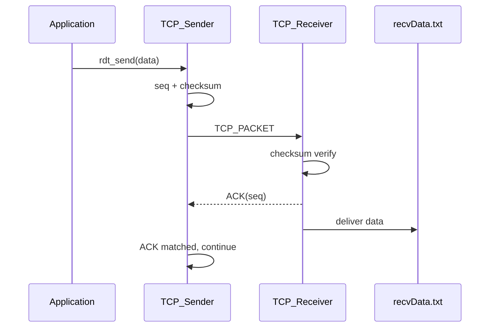

# OUC-TCP-Lab · RDT_1.0

<div align="center">

**可靠数据传输的基线版本：在理想信道下完成基本的数据封装、发送、确认与交付流程。**


[🏠 Main](https://github.com/Locusclaer/OUC-TCP-Lab/tree/main) · [RDT_2.0 →](https://github.com/Locusclaer/OUC-TCP-Lab/tree/RDT_2.0)

</div>

---

## 📖 分支定位

`RDT_1.0` 是整个 TCP 实验的起点。本阶段把底层网络视作**不会发生差错和丢包的理想信道**，重点不是处理异常，而是先打通课程框架中的完整发送链路：

```text
应用层数据
   ↓
TCP_Sender.rdt_send()
   ↓
封装 TCP_PACKET + Sequence Number + Checksum
   ↓
TCP_Sender.udt_send()
   ↓
课程提供的不可靠传输框架
   ↓
TCP_Receiver.rdt_recv()
   ↓
回复 ACK
   ↓
数据写入 recvData.txt
```

从代码实现上，本分支仍然保留了 ACK 与 Checksum 的框架，为后续 RDT 2.x / 3.0 的迭代提供统一结构；但 `th_eflag` 被设置为 `0`，因此本阶段不主动引入信道错误。

## 🎯 实验目标

- 熟悉课程提供的 `TCP_Sender_ADT` 与 `TCP_Receiver_ADT`；
- 理解应用层数据如何封装为 `TCP_PACKET`；
- 建立 Sequence Number、ACK 与 Checksum 的基本处理流程；
- 跑通 Sender → Channel → Receiver → ACK 的端到端链路；
- 为后续“数据损坏”“ACK 异常”“丢包”“超时重传”提供基线版本。

## 🔧 核心实现

### 1. Sender：构造并发送报文

在 `TCP_Sender.rdt_send()` 中：

```java
tcpH.setTh_seq(dataIndex * appData.length + 1);
tcpS.setData(appData);
tcpPack = new TCP_PACKET(tcpH, tcpS, destinAddr);
tcpH.setTh_sum(CheckSum.computeChkSum(tcpPack));
udt_send(tcpPack);
```

本实现将 `th_seq` 设置为：

```text
dataIndex × appData.length + 1
```

因此序号采用类似 TCP 字节流位置的方式增长，而不是简单的 `0 / 1` 交替序号。

发送后通过 `flag` 等待对应 ACK：

```java
while (flag == 0) Thread.onSpinWait();
```

因此当前阶段本质上仍然是 **Stop-and-Wait**：只有当前报文得到确认后，应用层的下一组数据才会继续发送。

### 2. Receiver：校验、确认与交付

接收端调用 `CheckSum.computeChkSum()` 对报文进行校验。对于正确报文：

```text
ACK = received sequence number
```

随后将数据加入 `dataQueue`，每累计 20 组数据调用 `deliver_data()` 写入：

```text
recvData.txt
```

### 3. CheckSum

`CheckSum.java` 使用 CRC32 对 TCP 报文中的关键字段计算校验值，主要覆盖：

- `seq`
- `ack`
- `data`

虽然 RDT 1.0 的理论模型假设信道不会损坏数据，但在工程实现中提前保留 Checksum 可以让后续分支只需要改变错误处理策略，而不需要重新设计报文格式。

## 🔄 协议流程



## 📂 关键文件

```text
src/com/ouc/tcp/test/
├── CheckSum.java       # CRC32 校验
├── TCP_Sender.java     # 发送端核心逻辑
├── TCP_Receiver.java   # 接收端核心逻辑
└── TestRun.java        # 实验入口
```

| 文件 | 作用 |
|---|---|
| `TCP_Sender.java` | 封装数据、设置序号与 Checksum、发送并等待 ACK |
| `TCP_Receiver.java` | 校验报文、生成 ACK、按批次交付数据 |
| `CheckSum.java` | 对 TCP Header 与 Segment 中的关键字段进行 CRC32 校验 |
| `TestRun.java` | 启动课程 TCP TestSys |

## 🧠 本阶段的关键认识

RDT 1.0 最重要的作用是建立“**可靠传输协议的最小骨架**”。在没有差错和丢包的前提下，发送端无需考虑重传策略，也无需设置超时定时器。

下一阶段将放宽这一理想假设：

> 如果报文本身在传输过程中发生 Bit Error，应当如何发现并恢复？

这就是 `RDT_2.0` 要解决的问题。

## 🚀 运行方式

项目使用 Maven 管理，`pom.xml` 将源码目录设置为 `src`，编译目标为 **Java 17**，入口类为：

```text
com.ouc.tcp.test.TestRun
```

`TestRun` 中通过课程框架的 `SystemStart.main(null)` 启动 TCP TestSys。

### 环境要求

- JDK 17
- Maven 3.x
- Linux
- 仓库中的 `lib/TCP_TestSys_Linux.jar`

### 编译

```bash
mvn clean package
```

也可以直接在 IntelliJ IDEA 中运行：

```text
src/com/ouc/tcp/test/TestRun.java
```

> `Config.ini` 中默认服务端口为 `18008`，发送端和接收端本地端口分别为 `19001`、`19002`。实际运行时仍需保证课程 TCP TestSys 服务端环境可用。

## 🔗 下一阶段

👉 [RDT_2.0：加入报文差错检测与 NACK/重传机制](https://github.com/Locusclaer/OUC-TCP-Lab/tree/RDT_2.0)

---

> 本仓库用于中国海洋大学《计算机网络》课程实验学习与个人归档，请独立完成课程作业。
