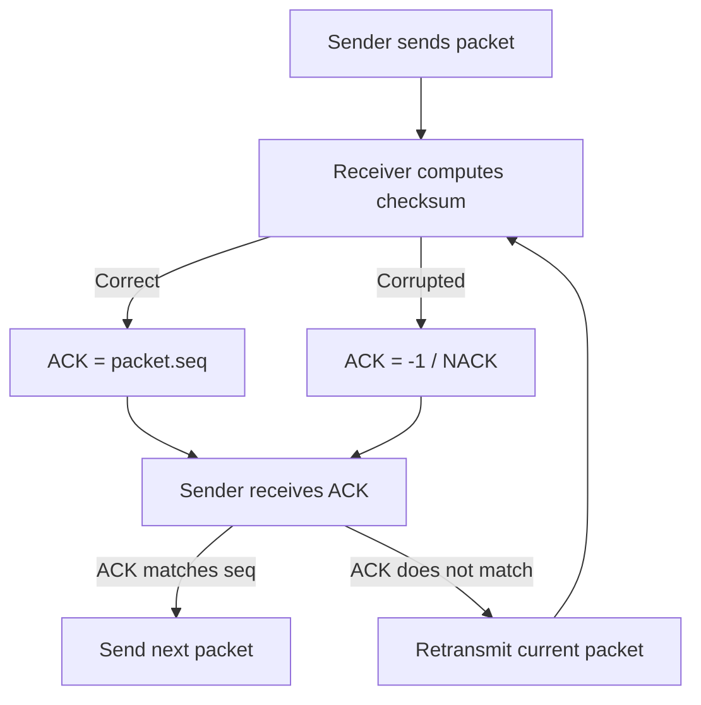

# OUC-TCP-Lab · RDT_2.0

<div align="center">

**在 RDT 1.0 基础上引入报文差错：Checksum + ACK/NACK + Retransmission。**


[🏠 Main](https://github.com/Locusclaer/OUC-TCP-Lab/tree/main) · [← RDT_1.0](https://github.com/Locusclaer/OUC-TCP-Lab/tree/RDT_1.0) · [RDT_2.2 →](https://github.com/Locusclaer/OUC-TCP-Lab/tree/RDT_2.2)

</div>

---

## 📖 分支定位

`RDT_2.0` 开始考虑现实网络中的第一个问题：

> **数据报在传输过程中可能发生 Bit Error。**

因此，仅仅“发送一次然后等待 ACK”已经不足以保证可靠性。本阶段加入：

- Checksum 差错检测；
- ACK / NACK 语义；
- 出错后的自动重传；
- Stop-and-Wait ARQ。

代码中 `udt_send()` 与 `reply()` 将 `th_eflag` 设置为 `1`，使课程实验框架进入对应的非理想信道测试模式。

## ✨ 相比 RDT_1.0 的变化

```text
RDT_1.0
  │
  │ 引入信道差错
  ▼
RDT_2.0
  ├── Checksum 检测错误
  ├── ACK 表示正确接收
  ├── ACK = -1 表示 NACK
  └── NACK / 错误 ACK → 重传当前报文
```

## 🔧 核心实现

### 1. Sender：仍采用 Stop-and-Wait

发送端构造报文：

```java
tcpH.setTh_seq(dataIndex * appData.length + 1);
tcpS.setData(appData);
tcpPack = new TCP_PACKET(tcpH, tcpS, destinAddr);
tcpH.setTh_sum(CheckSum.computeChkSum(tcpPack));
```

发送后等待 ACK。

当 ACK 与当前发送报文的 Sequence Number 相同：

```java
if (currentAck == tcpPack.getTcpH().getTh_seq()) {
    flag = 1;
}
```

说明报文成功传输。

否则：

```java
udt_send(tcpPack);
```

立即重传当前数据包。

### 2. Receiver：使用 Checksum 判断报文是否损坏

若：

```text
computed checksum == received checksum
```

则：

```text
ACK = recvPack.seq
```

并将数据加入交付队列。

若校验失败，则生成：

```text
ACK = -1
```

在该分支中，`-1` 被用作 **NACK**，通知发送方当前报文未被正确接收。

### 3. CheckSum：CRC32

`CheckSum.java` 使用 `java.util.zip.CRC32`，校验：

```text
seq + ack + data
```

其目标是让接收端能够检测报文内容是否在传输中发生改变。

## 🔄 运行逻辑



## ⚠️ 当前阶段仍未解决的问题

RDT 2.0 能处理“数据报损坏”，但还没有解决：

```text
Packet Loss
ACK Loss
Timeout
```

如果数据包或确认报文完全丢失，Sender 会永久等待，因为当前代码还没有定时器。

另外，RDT 2.0 使用显式 NACK。后续阶段可以进一步思考：

> 能不能只使用 ACK，而不再额外设计 NACK？

## 📂 关键文件

```text
src/com/ouc/tcp/test/
├── CheckSum.java
├── TCP_Sender.java
├── TCP_Receiver.java
└── TestRun.java
```

| 文件 | 本阶段作用 |
|---|---|
| `CheckSum.java` | CRC32 差错检测 |
| `TCP_Sender.java` | 等待确认；错误确认触发重传 |
| `TCP_Receiver.java` | 正确报文回复 ACK，损坏报文回复 `-1` |
| `TestRun.java` | 启动实验 |

## 🧠 核心知识点

本阶段对应可靠数据传输中的经典 **ARQ（Automatic Repeat reQuest）** 思想：

```text
Error Detection
      +
Feedback
      +
Retransmission
```

只要 Receiver 能发现错误并把结果反馈给 Sender，Sender 就可以重新发送，从而把“不可靠信道”逐步抽象成“可靠服务”。

## 🚀 运行方式

项目使用 Maven 管理，`pom.xml` 将源码目录设置为 `src`，编译目标为 **Java 17**，入口类为：

```text
com.ouc.tcp.test.TestRun
```

`TestRun` 中通过课程框架的 `SystemStart.main(null)` 启动 TCP TestSys。

### 环境要求

- JDK 17
- Maven 3.x
- Linux
- 仓库中的 `lib/TCP_TestSys_Linux.jar`

### 编译

```bash
mvn clean package
```

也可以直接在 IntelliJ IDEA 中运行：

```text
src/com/ouc/tcp/test/TestRun.java
```

> `Config.ini` 中默认服务端口为 `18008`，发送端和接收端本地端口分别为 `19001`、`19002`。实际运行时仍需保证课程 TCP TestSys 服务端环境可用。

## 🔗 下一阶段

👉 [RDT_2.2：取消显式 NACK，使用重复 ACK 表达异常](https://github.com/Locusclaer/OUC-TCP-Lab/tree/RDT_2.2)

---

> 本仓库用于课程学习与个人实验归档，请勿直接复制作为课程作业提交。
