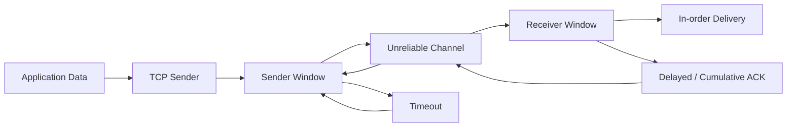

# OUC-TCP-Lab · TCP

<div align="center">

**面向 TCP 的可靠传输实现：滑动窗口、乱序缓存、累计确认与延迟 ACK。**


[🏠 Main](https://github.com/Locusclaer/OUC-TCP-Lab/tree/main) · [← GBN](https://github.com/Locusclaer/OUC-TCP-Lab/tree/GBN) · [Tahoe →](https://github.com/Locusclaer/OUC-TCP-Lab/tree/Tahoe)

</div>

---

## 📖 分支定位

`TCP` 分支不再单纯复现某一个教学协议，而是把前面 RDT / GBN / SR 中的关键机制组合起来，构建一个**更接近 TCP 行为的可靠数据传输版本**。

这一分支的实现特征是：

- Sender 使用滑动窗口；
- Sender 使用累计 ACK 推进窗口；
- Sender 对窗口左沿设置重传 Timer；
- Timeout 时重新发送窗口中的未确认数据；
- Receiver 可以缓存窗口内乱序 Packet；
- Receiver 只按序向应用层交付；
- Receiver 使用延迟 ACK / 累计 ACK；
- 数据错误直接丢弃，依靠超时或重复确认恢复。

它可以看作后续 Tahoe / Reno 拥塞控制的可靠传输基础层。

## 🧩 设计来源

```text
RDT 3.0
  └── Timeout / Retransmission
          +
GBN
  └── Cumulative ACK / Sender Window
          +
SR
  └── Receiver-side Out-of-order Buffer
          ↓
        TCP
```

## 🪟 Sender Window

发送窗口大小：

```text
16
```

构造：

```java
new SenderWindow(this, 16, 3000, 3000)
```

Sender 使用：

```text
base
nextPointer
rearPointer
```

维护窗口状态，并通过环形数组保存尚未确认的 Packet。

当窗口满时，`rdt_send()` 等待 ACK 使窗口移动；窗口有空间后才能继续写入新数据。

## ✅ Cumulative ACK

Sender 收到 ACK 后：

```java
packet.seq <= ack.seq
```

的所有窗口元素都会被视为已经确认。

因此一个 ACK 可以一次推进多个 Packet：

```text
Before:
[101][201][301][401][501]

Receive ACK 301

After:
               [401][501]
```

这与 TCP 的累计确认思想一致。

## 📥 Receiver：缓存乱序 Packet

Receiver Window 大小同样为 16。

对合法窗口内 Packet：

```text
seq == base
    → 缓存，并开始连续交付

base < seq < base + window
    → 先缓存，等待缺失的前序 Packet

seq < base
    → duplicate

seq >= base + window
    → outside
```

例如：

```text
Receive 4
Receive 5
Receive 3
```

4、5 会先进入 Receiver Window。

收到 3 后：

```text
Deliver 3 → Deliver 4 → Deliver 5
```

因此网络乱序不会导致应用层乱序。

## 🕒 Delayed ACK

接收端维护：

```java
private UDT_Timer cumulativeTimer
```

收到可以推进 `base` 的数据后，并不一定立即回复 ACK，而是重置约：

```text
500 ms
```

的确认 Timer。

如果这段时间继续收到连续数据，最终 ACK 可以覆盖多个 Packet，从而减少控制报文数量。

对于 duplicate / outside 等情况，则可以立即回复当前 ACK，帮助 Sender 快速了解接收状态。

## ⏱️ Timeout Retransmission

Sender 以窗口左沿作为重传控制核心。

Timer 超时后：

```text
nextPointer = base
```

并重新发送窗口内尚未确认的 Packet。

因此本分支已经具有：

```text
Reliability
+
Pipelining
+
Out-of-order Buffer
+
Cumulative ACK
+
Delayed ACK
```

## 🔄 数据流



## 📂 关键代码结构

```text
src/com/ouc/tcp/test/
├── AckFlag.java
├── CheckSum.java
├── ReceiverElem.java
├── ReceiverFlag.java
├── ReceiverWindow.java
├── SenderElem.java
├── SenderFlag.java
├── SenderWindow.java
├── TCP_Receiver.java
├── TCP_Sender.java
├── TestRun.java
├── WindowElement.java
└── WindowFlag.java
```

## ✅ 当前已实现与尚未实现

| 机制 | TCP 分支 |
|---|---|
| Checksum | ✅ |
| Sequence Number | ✅ |
| Sliding Window | ✅ |
| Out-of-order Buffer | ✅ |
| Cumulative ACK | ✅ |
| Delayed ACK | ✅ |
| Timeout Retransmission | ✅ |
| Congestion Window `cwnd` | ❌ |
| Slow Start | ❌ |
| Congestion Avoidance | ❌ |
| Fast Retransmit | ❌ |

可靠传输已经完成，下一步需要解决：

> 如果网络是可靠的，但 Sender 发送得太快，以至于网络本身发生拥塞怎么办？

## 🚀 运行方式

项目使用 Maven 管理，`pom.xml` 将源码目录设置为 `src`，编译目标为 **Java 17**，入口类为：

```text
com.ouc.tcp.test.TestRun
```

`TestRun` 中通过课程框架的 `SystemStart.main(null)` 启动 TCP TestSys。

### 环境要求

- JDK 17
- Maven 3.x
- Linux
- 仓库中的 `lib/TCP_TestSys_Linux.jar`

### 编译

```bash
mvn clean package
```

也可以直接在 IntelliJ IDEA 中运行：

```text
src/com/ouc/tcp/test/TestRun.java
```

> `Config.ini` 中默认服务端口为 `18008`，发送端和接收端本地端口分别为 `19001`、`19002`。实际运行时仍需保证课程 TCP TestSys 服务端环境可用。

## 🔗 下一阶段

👉 [Tahoe：加入 cwnd、Slow Start、Congestion Avoidance 与 Fast Retransmit](https://github.com/Locusclaer/OUC-TCP-Lab/tree/Tahoe)

---

> 本仓库用于课程学习与个人实验归档，请勿直接复制作为课程作业提交。
