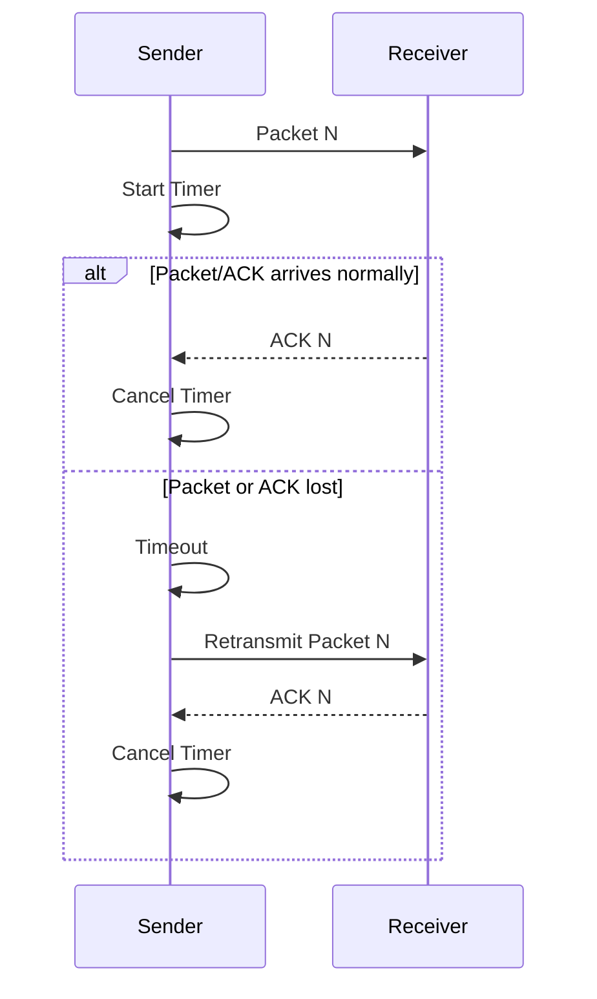

# OUC-TCP-Lab · RDT_3.0

<div align="center">

**在差错检测基础上加入 Timeout Retransmission，使协议能够处理 Packet Loss。**


[🏠 Main](https://github.com/Locusclaer/OUC-TCP-Lab/tree/main) · [← RDT_2.2](https://github.com/Locusclaer/OUC-TCP-Lab/tree/RDT_2.2) · [SR →](https://github.com/Locusclaer/OUC-TCP-Lab/tree/SR)

</div>

---

## 📖 分支定位

`RDT_3.0` 解决 Stop-and-Wait 可靠传输中的另一个核心问题：

> **如果数据包或 ACK 不是“损坏”，而是彻底丢失怎么办？**

RDT 2.x 依赖 Receiver 的反馈来决定是否重传；一旦反馈根本没有到达，Sender 就可能永久等待。

因此本阶段加入：

- `UDT_Timer`
- `UDT_RetransTask`
- Timeout Retransmission
- ACK 到达后的定时器取消

至此，Stop-and-Wait 协议已经可以同时应对 **Bit Error + Packet Loss**。

## ✨ 相比 RDT_2.2 的变化

```text
RDT_2.2
Checksum + ACK + Retransmission
           │
           │ 无法处理“什么都没收到”
           ▼
RDT_3.0
Checksum + ACK + Timer + Timeout Retransmission
```

## ⏱️ 超时重传实现

发送每个报文前创建定时器：

```java
timer = new UDT_Timer();
UDT_RetransTask retransTask =
    new UDT_RetransTask(client, tcpPack);

timer.schedule(retransTask, 1000, 1000);
```

也就是说：

- 首次超时：约 `1000 ms`
- 未确认时：每 `1000 ms` 继续尝试重传

当 Sender 收到与当前报文对应的 ACK：

```java
timer.cancel();
flag = 1;
```

当前数据块才算完成。

## 📥 Receiver 的乱序处理

Receiver 将字节流序号换算为逻辑数据块序号：

```java
int dataIndex =
    (recvPack.getTcpH().getTh_seq() - 1)
    / recvPack.getTcpS().getData().length;
```

并仅处理：

```text
dataIndex <= sequence
```

的报文。

其中：

- `dataIndex == sequence`：当前恰好期待的报文，交付；
- `dataIndex < sequence`：可能是因为 ACK 丢失导致的重传报文，只重新确认、不重复交付；
- `dataIndex > sequence`：提前到达的乱序报文丢弃。

因此应用层不会收到重复数据。

## 🔄 协议流程



## ✅ 本阶段已经具备

| 机制 | 支持 |
|---|---|
| Sequence Number | ✅ |
| Checksum | ✅ |
| ACK | ✅ |
| Duplicate Detection | ✅ |
| Retransmission | ✅ |
| Timeout | ✅ |
| Packet Loss Recovery | ✅ |
| Sliding Window | ❌ |
| Pipelining | ❌ |

## ⚠️ Stop-and-Wait 的性能瓶颈

虽然 RDT 3.0 已经可以可靠传输，但 Sender 的发送过程仍然是：

```text
Send 1 packet
     ↓
Wait ACK
     ↓
Send next packet
```

在 RTT 较大的网络中，大部分时间都浪费在等待 ACK，链路利用率较低。

因此下一阶段不再只追求“能不能可靠传”，而是关注：

> **如何在保证可靠性的同时，让多个报文同时处于传输过程中？**

答案就是 Sliding Window。

## 🚀 运行方式

项目使用 Maven 管理，`pom.xml` 将源码目录设置为 `src`，编译目标为 **Java 17**，入口类为：

```text
com.ouc.tcp.test.TestRun
```

`TestRun` 中通过课程框架的 `SystemStart.main(null)` 启动 TCP TestSys。

### 环境要求

- JDK 17
- Maven 3.x
- Linux
- 仓库中的 `lib/TCP_TestSys_Linux.jar`

### 编译

```bash
mvn clean package
```

也可以直接在 IntelliJ IDEA 中运行：

```text
src/com/ouc/tcp/test/TestRun.java
```

> `Config.ini` 中默认服务端口为 `18008`，发送端和接收端本地端口分别为 `19001`、`19002`。实际运行时仍需保证课程 TCP TestSys 服务端环境可用。

## 🔗 后续分支

- [SR：Selective Repeat，逐包确认与逐包定时器](https://github.com/Locusclaer/OUC-TCP-Lab/tree/SR)
- [GBN：Go-Back-N，累计确认与窗口整体重传](https://github.com/Locusclaer/OUC-TCP-Lab/tree/GBN)

---

> 本仓库用于课程学习与个人实验归档，请勿直接复制作为课程作业提交。
